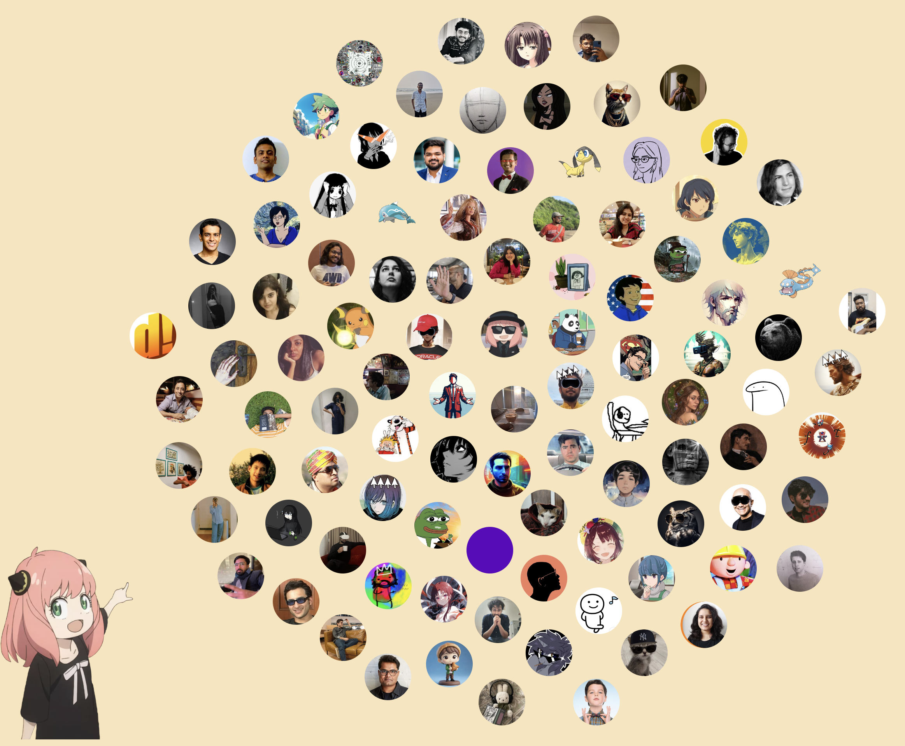
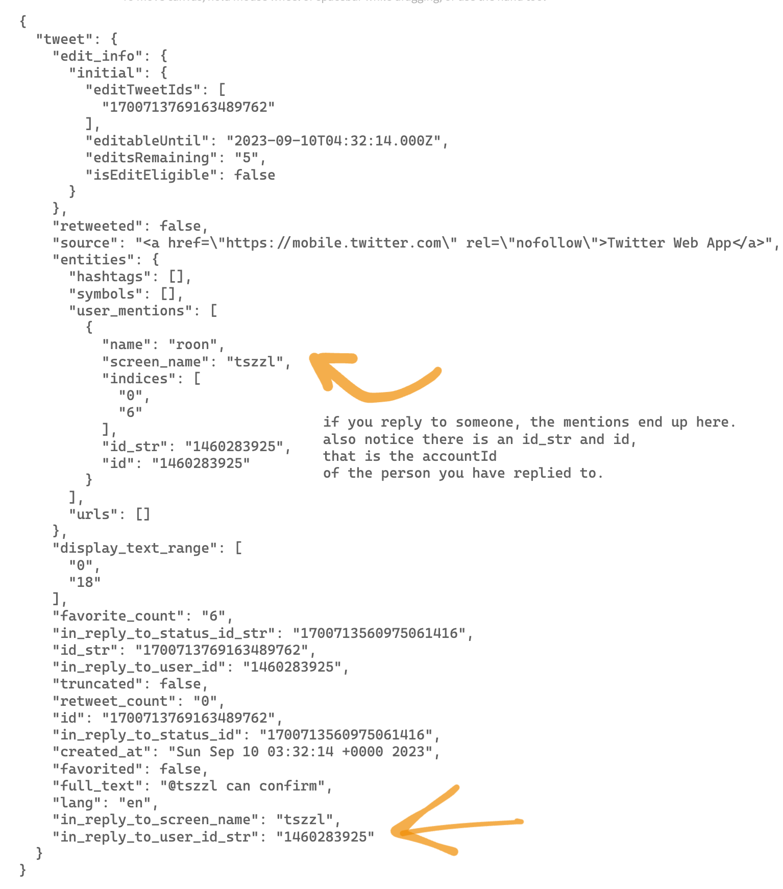

# Twitter Circle




## A tool to visualize your Twitter network and direct messaging history

## Features

1. Make a Twitter Circle visualization for upto 200 users
2. Check leaderboard based on combined weights of *all* your mentions of other users and *all* direct messages
3. Check DM stats (purely messages) like messages sent/recieved per user, total messages, last message with them
4. DM bar graph where you can see messages/month for 5 years data

## Setup

1. [Download your Twitter archive.](https://help.twitter.com/en/managing-your-account/how-to-download-your-x-archive) 

    `More (3 dot button) > Your Account > Download an archive of your data`

   It takes around 1-2 days.

    Clone the repository:
    ```
    git clone https://github.com/sankalp1999/twitter-circle.git
    ```

2.  Copy your Twitter archive into the project folder and rename the archive/zip file to `twitter-archive`
You just have to ensure the archive is on the root folder of the project.


3. Install Node.js (for Linux and macOS):
   - Visit the official Node.js website: https://nodejs.org
   - Download the appropriate version for your operating system
   - Follow the installation instructions provided on the website


4. Install project dependencies:
   ```
   npm install
   ```
   This command will install all the necessary packages listed in the `package.json` file.

5. Set up the project (Linux and macOS):
   ```
   chmod +x setup.sh
   ./setup.sh
   ```
   This will make the `setup.sh` script executable and run it to set up the project.


6. Start the application:
   ```
   npm start
   ```
   This command will start the Twitter Circle application.


You may see some timeouts/errors for the profile picture script. You can still proceed
or if too many pictures are missing, please re-run the script.

## Share Screenshots

Don't forget to share screenshots. If you are feeling courageous, I dare you to share your DM stat leaderboard screenshots.

### Screenshotting tips
- Exclude the slider from the image. You may choose to include Anya too, she is placed above the slider
- If you are going for 150 or 200, I recommend zooming out browser till it fits (67%)


## Open to feedback

Let me know in the DMs or maybe PRs. I don't primarily write JS so open to suggestions
to make the code or UI better.

## Flow of execution

### relevant files used from the archive 

```
account.js - contains basic detail of your account like accountId and userhandle/screenname 
tweets.js - contains all your tweets (normal tweet, replies, quote tweets) with data like reply mentions, quote tweet url, text, media url
direct-messages.js - all your personal messages, no group chat messages
```

### Scripts

`extract_mentions_and_dump.js` - Extracts the mentions that are based on *your* replies and quote tweets. I sum up
the mentions and apply a weighting mechanism based on time difference to ensure the relevance of interactions. Recent interactions
get slightly more weightage.

> We percieve people we interacted with recently to be closer to us - the time weight heuristic is provided to account
for the recency bias

At the beginning of the file, you can see I am creating a mapping from accountId / user id to username and vice-versa
this helps to avoid scraping. This mapping is required because the direct messaging data only has accountIds and no userhandles.
The mapping will work if you have replied to the person atleast once otherwise their accountId won't be known 
(and we won't be able to map from DM to here). There is a scraping workaround but I wanted to avoid it 
as it takes time plus want to keep scraping at minimum. see `utils/fetch_user_id_to_user_name.js`

`preprocess_direct-messages.js` - Extracts messaging data, process *all* messages except the group chat from the day you joined the bird app, get basic stats, calculate DM weights based on same modified power law decay function as above and add them to existing weights.

`pfp_fetch_and_id_correction.js` - Get the profile pictures using puppeteer from sotwe dot com, get profile banner
if id was not found earlier, use profile banner to get accountID and use it to correct id_to_username or vice-versa mapping for topN people. 

This file is educational if you want to learn about basics of concurrent scraping.

`direct-messaging-stats/dm_final_stats_processing.js` - preprocesses conversations to count messages/month for 5 years and enable drawing graph 
available by clicking on fields in the DM stats file.

`index.html` - show twitter circle, uses D3.js, vanilla html and css
`leaderboard.html` - show ranking of your friends using combined weights of replies, mentions, DMs, vanilla html and css
`dm_stats.html` - dm stats table, click on card to see chart
`direct-messaging-stats/chart_draw.html` - graph using chart.js


### Solving for username to user id mapping without scraping


Just look at the data like Lain. Stare at it.




We get free mapping between name and id. It took me sometime to realise this. I had already written the scraper.
If you have replied to someone atleast once, then you have a valid mapping.


### Bugs and Limitations
- You may see some @notfound_userid in the DM stats table. These are accounts where we couldn't find a 
mapping between username and id from the reply mentions data. Since there combined weights do not end up
in the topN, their pfp and banner is not fetched so they end up as not found. 

I can add some code to fetch banners (so i can get the userid) for top 200 dm stats also. It will require less than 200 ofc
because most people you talk to in DM you have replied to them atleast once on the timeline.

if you really want to find them, you can try going to twitter.com/intent/user?user_id=user_id
or try twitter.com/i/user/user_id. you need to be logged in for this.
